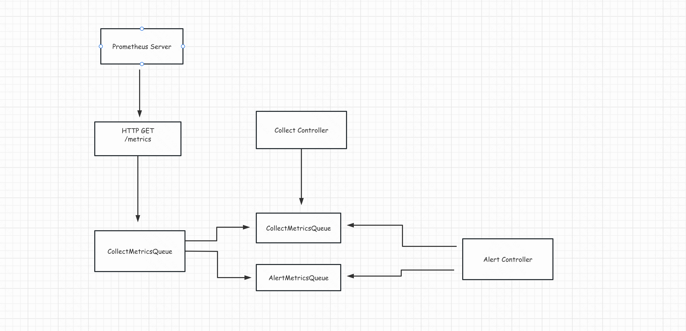

# version-control-manager

### collect plan
- container: Fragen Sie das Tag und den sha265-Image-Wert jedes Containers über den CLI-Befehl container runtime (containerd & dockerd) ab
- custom: Erhalten Sie Ergebnisse durch benutzerdefinierte Befehle (Sie müssen sicherstellen, dass der Befehl im Container ausführbar ist, wenn Sie die Hostanwendung sammeln, müssen Sie den Befehl in den Container einhängen)

### Architecture diagram

### QuickStart
```shell
go run cmd/venom/venom.go --cluster xxxxx --collect-rule-file collect_rule.yaml --alert-rule-file alert_rule.yaml
```
### FAQ

#### 1、About the storage of collected metrics
We suggest to report the completed application and version number to your own platform for display by command

#### About the configuration delivery of alarm indicators
We recommend that the user provide an interface that can pull the expected application

#### 2、About storage reporting issues
If the service pressure of the reporting interface provider is very high, it is recommended to use the aggregation method, 
and the master after the election will get the data of the slave through rpc and send it in batches

#### 3、Regarding the indicator that the application version does not meet expectations
```text
venom_version_collect
```

##### 4、Metrics about exposed app versions
```text
venom_version_diff
```

##### 5、About Deployment Scenarios
We strongly recommend deploying the service in k8s and deploying it in daemonset mode, and mount some necessary environment variables to the container environment.
